# Docker Container Infrastructure & GCP Artifact Registry

## 📋 Overview
This project demonstrates a complete containerization workflow using **Docker** and **Google Cloud Platform (GCP)**. It implements infrastructure-as-code principles to decouple applications from the underlying infrastructure.

The pipeline builds a Node.js application and manages the container lifecycle via **Google Artifact Registry**, focusing on standard DevOps practices.

## 🏗 Architecture
1.  **Development**: Node.js application creation.
2.  **Containerization**: Multi-layer image construction using `node:lts`.
3.  **Registry**: Pushing immutable images to Google Artifact Registry.
4.  **Deployment**: Validating containers in isolated environments.

## 🛠 Tech Stack
* **Cloud**: Google Cloud Platform (GCP)
* **Containerization**: Docker
* **Registry**: Google Artifact Registry
* **Runtime**: Node.js (LTS)

## 🚀 How to Reproduce (Step-by-Step)

### Prerequisites
* Google Cloud Platform Account
* GCP Project with Billing Enabled
* `gcloud` CLI installed and authenticated
* Docker installed

### 1. Setup Environment Variables
Replace the values below with your specific Project ID and preferred Region:

```bash
export PROJECT_ID="your-project-id-here"
export REGION="europe-west4"
export REPO_NAME="my-repository"
```

### 2. Configure GCP Infrastructure
Enable the Artifact Registry API and create the repository:

```bash
# Authenticate Docker with GCP
gcloud auth configure-docker ${REGION}-docker.pkg.dev

# Create the Artifact Registry repository
gcloud artifacts repositories create ${REPO_NAME} \
    --repository-format=docker \
    --location=${REGION} \
    --description="Docker repository for portfolio"
```

### 3. Build & Push Image
Build the container using the cloud path and push it to the registry:

```bash
# Build
docker build -t ${REGION}-docker.pkg.dev/${PROJECT_ID}/${REPO_NAME}/node-app:0.2 .

# Push to Google Cloud
docker push ${REGION}-docker.pkg.dev/${PROJECT_ID}/${REPO_NAME}/node-app:0.2
```

### 4. Run Locally (Testing)
Pull the image back from the cloud and run it to verify portability:

```bash
# Run container (mapping port 4000 to internal 80)
docker run -p 4000:80 -d ${REGION}-docker.pkg.dev/${PROJECT_ID}/${REPO_NAME}/node-app:0.2

# Verify output
curl http://localhost:4000
```

---
*Verified execution on Google Cloud Platform.*

## 📊 Workflow Visualization

```mermaid
graph LR
    A[💻 Developer] -->|Code + Dockerfile| B(🐳 Docker Build)
    B -->|Tag Image| C{📦 Local Image}
    C -->|gcloud auth| D[☁️ GCP Artifact Registry]
    D -->|docker pull| E[🚀 Runtime Container]
    
    style D fill:#4285F4,stroke:#333,stroke-width:2px,color:white
    style E fill:#34A853,stroke:#333,stroke-width:2px,color:white
```

